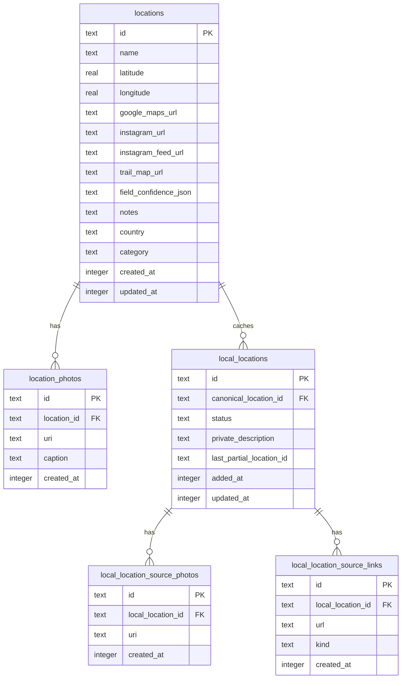
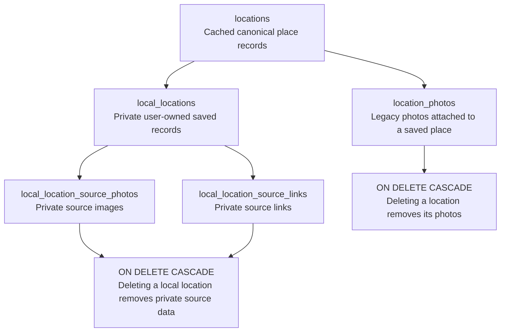

# Database Schema

Traveler stores saved places in SQLite through Drizzle ORM. The schema keeps canonical cached location data separate from private local source data.

## Entity Relationship Diagram

## Table Details

### `locations`

| Column | Type | Notes |
| --- | --- | --- |
| `id` | `text` | Primary key generated locally. |
| `name` | `text` | Optional display name. |
| `latitude` | `real` | Optional GPS latitude. |
| `longitude` | `real` | Optional GPS longitude. |
| `google_maps_url` | `text` | Optional external map link. |
| `instagram_url` | `text` | Legacy optional social link. |
| `instagram_feed_url` | `text` | Optional canonical public Instagram location/hashtag feed URL. |
| `trail_map_url` | `text` | Optional trail map link. |
| `field_confidence_json` | `text` | Optional JSON confidence scores returned by recognition. |
| `notes` | `text` | Optional user notes. |
| `country` | `text` | Country or curated travel region label. |
| `category` | `text` | Traveler category label normalized by app helpers. |
| `created_at` | `integer` | Required timestamp in milliseconds. |
| `updated_at` | `integer` | Required timestamp in milliseconds. |

Indexes:

- `locations_country_idx` on `country`
- `locations_category_idx` on `category`
- `locations_created_at_idx` on `created_at`

### `local_locations`

| Column | Type | Notes |
| --- | --- | --- |
| `id` | `text` | Primary key generated locally. |
| `canonical_location_id` | `text` | Optional link to cached canonical `locations.id`. |
| `status` | `text` | Recognition status: processing, matched, needsReview, or failed. |
| `private_description` | `text` | User-provided private notes/description. |
| `last_partial_location_id` | `text` | Last queued recognition event associated with this record. |
| `added_at` | `integer` | Required timestamp in milliseconds for recently-added grouping. |
| `updated_at` | `integer` | Required timestamp in milliseconds. |

Indexes:

- `local_locations_canonical_location_id_idx` on `canonical_location_id`
- `local_locations_status_idx` on `status`
- `local_locations_added_at_idx` on `added_at`

### `local_location_source_photos`

| Column | Type | Notes |
| --- | --- | --- |
| `id` | `text` | Primary key generated locally. |
| `local_location_id` | `text` | Required foreign key to `local_locations.id`. |
| `uri` | `text` | Required private source photo URI. |
| `created_at` | `integer` | Required timestamp in milliseconds. |

Indexes:

- `local_location_source_photos_local_location_id_idx` on `local_location_id`

### `local_location_source_links`

| Column | Type | Notes |
| --- | --- | --- |
| `id` | `text` | Primary key generated locally. |
| `local_location_id` | `text` | Required foreign key to `local_locations.id`. |
| `url` | `text` | Required private source URL. |
| `kind` | `text` | Source link kind such as instagram, google-maps, alltrails, or web. |
| `created_at` | `integer` | Required timestamp in milliseconds. |

Indexes:

- `local_location_source_links_local_location_id_idx` on `local_location_id`
- `local_location_source_links_url_idx` on `url`

### `location_photos`

| Column | Type | Notes |
| --- | --- | --- |
| `id` | `text` | Primary key generated locally. |
| `location_id` | `text` | Required foreign key to `locations.id`. |
| `uri` | `text` | Required local or remote photo URI. |
| `caption` | `text` | Optional caption. |
| `created_at` | `integer` | Required timestamp in milliseconds. |

Indexes:

- `location_photos_location_id_idx` on `location_id`
