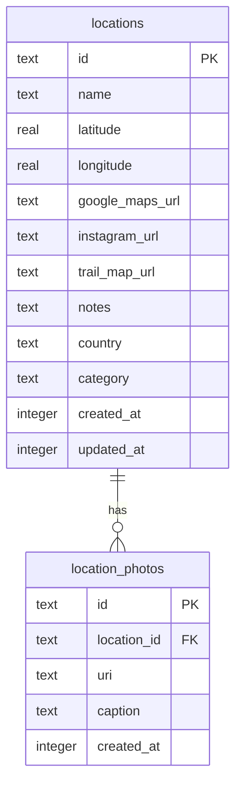
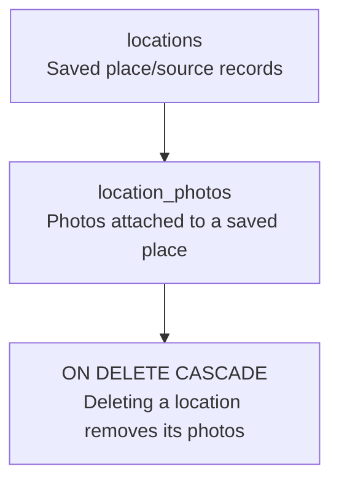

# Database Schema

Traveler stores saved places in SQLite through Drizzle ORM. The schema currently has one primary table for locations and one child table for photos.

## Entity Relationship Diagram

## Table Details

### `locations`

| Column | Type | Notes |
| --- | --- | --- |
| `id` | `text` | Primary key generated locally. |
| `name` | `text` | Optional display name. |
| `latitude` | `real` | Optional GPS latitude. |
| `longitude` | `real` | Optional GPS longitude. |
| `google_maps_url` | `text` | Optional external map link. |
| `instagram_url` | `text` | Optional social link. |
| `trail_map_url` | `text` | Optional trail map link. |
| `notes` | `text` | Optional user notes. |
| `country` | `text` | Country or curated travel region label. |
| `category` | `text` | Traveler category label normalized by app helpers. |
| `created_at` | `integer` | Required timestamp in milliseconds. |
| `updated_at` | `integer` | Required timestamp in milliseconds. |

Indexes:

- `locations_country_idx` on `country`
- `locations_category_idx` on `category`
- `locations_created_at_idx` on `created_at`

### `location_photos`

| Column | Type | Notes |
| --- | --- | --- |
| `id` | `text` | Primary key generated locally. |
| `location_id` | `text` | Required foreign key to `locations.id`. |
| `uri` | `text` | Required local or remote photo URI. |
| `caption` | `text` | Optional caption. |
| `created_at` | `integer` | Required timestamp in milliseconds. |

Indexes:

- `location_photos_location_id_idx` on `location_id`
